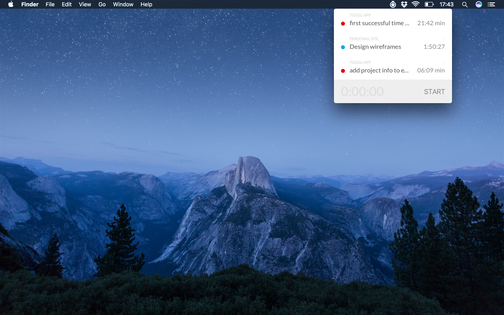
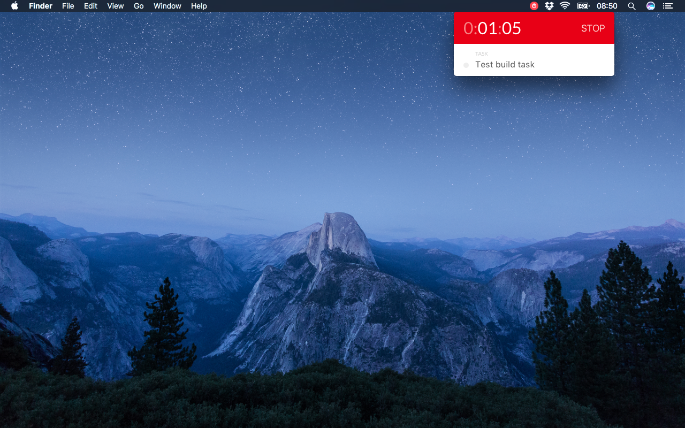
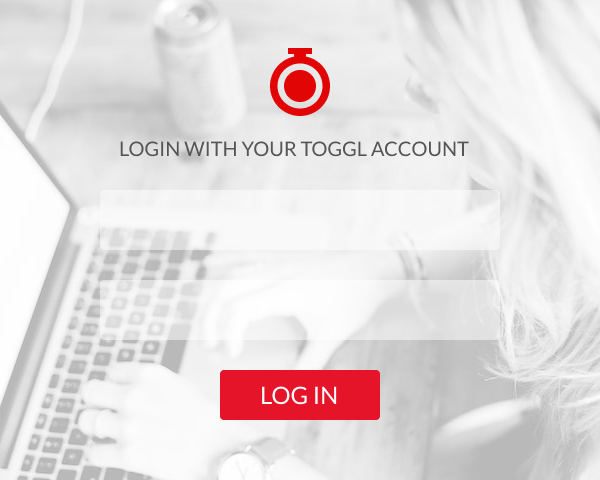
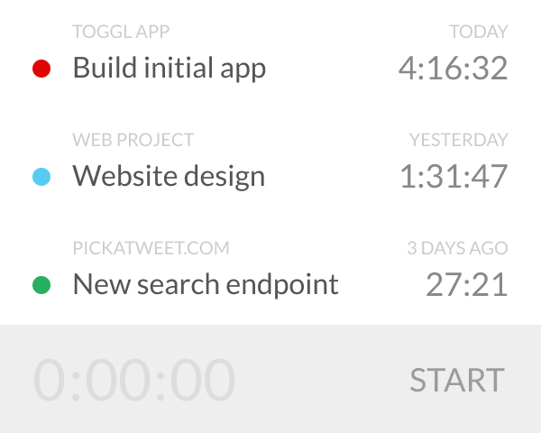

# Toggl menubar app

Simple time tracking menubar app that works with Toggl.
Made with Electron, React, Webpack, Babel, Figma and [toggl api](https://github.com/toggl/toggl_api_docs).

:warning: Work in progress

## Development

* Clone this repo
* Run `npm install` and then in two separate terminal windows:
* `npm start` and `npm run electron`

## Screenshots

### App

### Original designs

Login | Dashboard | Tracking
--- | --- | ---
 |  | 
